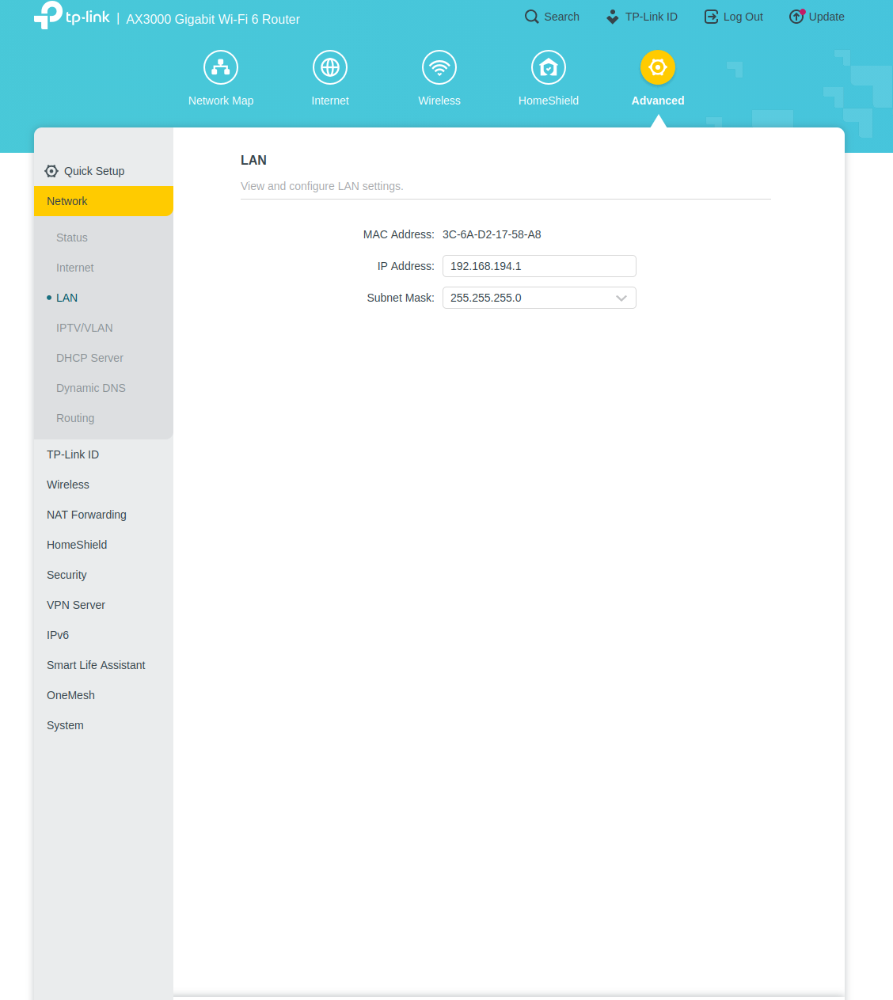
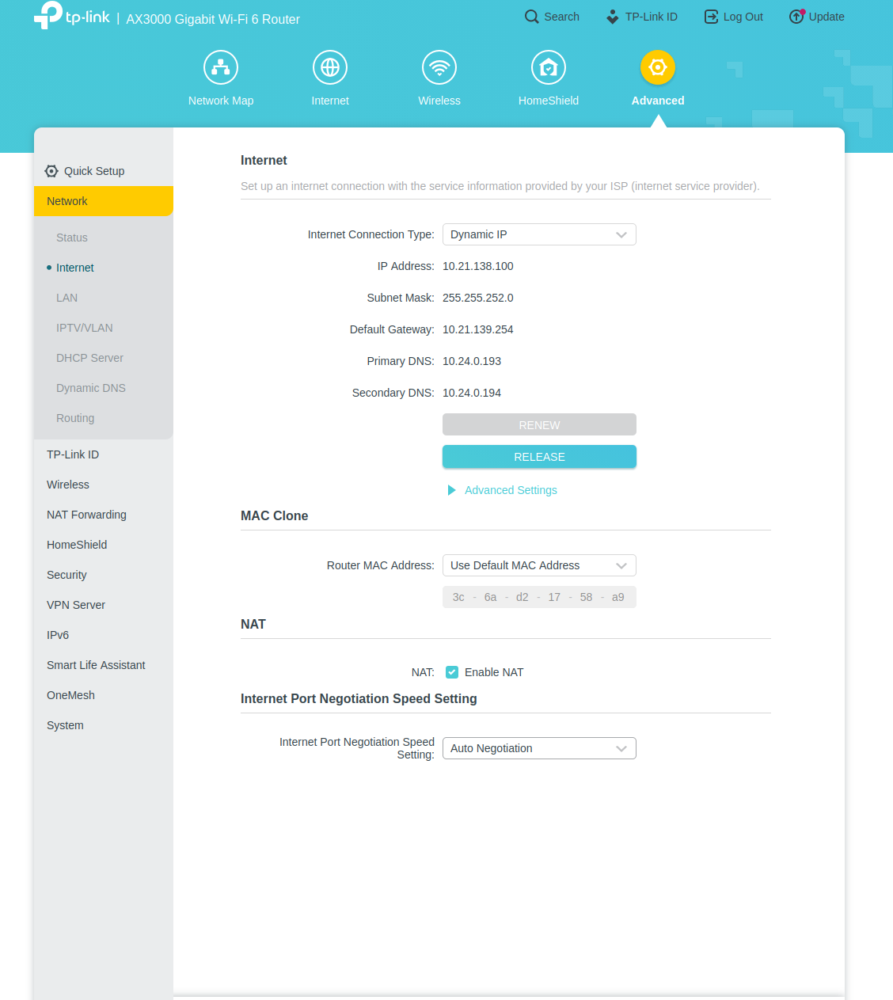
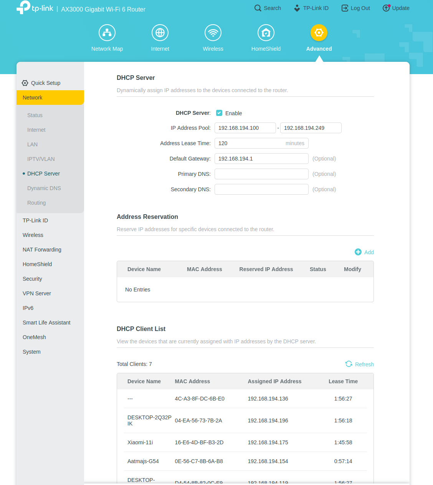

# Jetson Setup Guide

## Platform

- **Hardware:** NVIDIA Jetson
- **JetPack Version:** 6.2

---

# Wi-Fi + Ethernet

Wi-Fi for internet. Ethernet static IP `192.168.194.10` for the vehicle LAN (ground station, DVL, sonars).

## Auto-connect to Wi-Fi and Set Hostname

```bash
sudo nmcli device wifi list
sudo nmcli device wifi connect WIFI_NAME password WIFI_PASSWORD
sudo nmcli connection modify WIFI_NAME connection.autoconnect yes
sudo hostnamectl set-hostname HOSTNAME
```

Example for this lab:

```bash
sudo nmcli device wifi connect mavlab password mavlab24
sudo nmcli connection modify mavlab connection.autoconnect yes
sudo hostnamectl set-hostname timi
```

## Static IP on Ethernet

Persistent static IP on `enP8p1s0` (`192.168.194.0/24`).

| Links up | Internet | Vehicle LAN `192.168.194.x` | SSH |
|---|---|---|---|
| Ethernet + Wi-Fi (`mavlab`) | **Wi-Fi** (lower metric) | Ethernet | both (`192.168.194.10` and Wi-Fi IP) |
| Ethernet only | **Ethernet** via `192.168.194.1` | Ethernet | `192.168.194.10` |
| Wi-Fi only | **Wi-Fi** | none (no `.10` until Ethernet is back) | Wi-Fi IP |

NetworkManager adds ~20000 to the Wi-Fi default metric, so a Wi-Fi `ipv4.route-metric 50` shows up as **20050** on `default`. Ethernet’s default must be **higher** than that (30000) or Ethernet would steal the internet while both are connected.

```bash
# Create the profile if it does not exist yet
sudo nmcli connection add type ethernet con-name eth_switch ifname enP8p1s0 \
  ipv4.method manual \
  ipv4.addresses 192.168.194.10/24 \
  ipv4.gateway 192.168.194.1 \
  ipv4.dns "8.8.8.8 1.1.1.1"

# Ethernet: vehicle LAN + internet fallback (not preferred when Wi-Fi is up)
sudo nmcli connection modify eth_switch \
  ipv4.never-default no \
  ipv4.gateway 192.168.194.1 \
  ipv4.route-metric 30000 \
  connection.autoconnect yes

# Wi-Fi: preferred internet + autoconnect (name must be mavlab, not "mavlab 1")
sudo nmcli connection modify mavlab \
  ipv4.route-metric 50 \
  connection.autoconnect yes

sudo nmcli connection up eth_switch
sudo nmcli connection up mavlab
```

Verify addresses, which path is used, and autoconnect:

```bash
nmcli -f NAME,DEVICE,AUTOCONNECT connection show
ip -4 addr show enP8p1s0
ip -4 addr show wlP1p1s0
ip route
ip route get 8.8.8.8
ip route get 192.168.194.1
```

Expected while **both** are connected:

```text
NAME        DEVICE    AUTOCONNECT
mavlab      wlP1p1s0  yes
eth_switch  enP8p1s0  yes

default via 192.168.1.1   dev wlP1p1s0   metric 20050
default via 192.168.194.1 dev enP8p1s0   metric 30000
192.168.194.0/24          dev enP8p1s0   src 192.168.194.10
192.168.1.0/24            dev wlP1p1s0   src 192.168.1.162

8.8.8.8 via 192.168.1.1 dev wlP1p1s0
```

`ip route get 8.8.8.8` → `wlP1p1s0` means internet uses mavlab Wi-Fi.  
`ip route get 192.168.194.1` → `enP8p1s0` means DVL / sonars / this PC stay on Ethernet.

If Wi-Fi is down, the only default is Ethernet (`metric 30000`) and internet goes via `192.168.194.1`.

If you cannot ping a sonar or other device on the switch, bounce the Ethernet NIC:

```bash
sudo nmcli device disconnect enP8p1s0
sudo nmcli device connect enP8p1s0
```

Then ping the target again.

---

# SSH Installation

Install and enable the SSH server.

```bash
sudo apt update
sudo apt install -y openssh-server
sudo systemctl enable ssh
sudo systemctl start ssh
```

---

# Git Installation

Install Git.

```bash
sudo apt-get update
sudo apt-get install git -y
```

---

# Docker Installation

Install Docker and add the current user to the Docker group.

```bash
sudo apt update
sudo apt install docker-ce docker-ce-cli containerd.io docker-buildx-plugin docker-compose-plugin -y
sudo systemctl enable docker
sudo systemctl start docker
sudo usermod -aG docker $USER
```

---

# USB Wi-Fi Adapter Driver Installation

Install the driver for the USB Wi-Fi adapter.

```bash
sudo apt install dkms git build-essential
git clone https://github.com/morrownr/88x2bu-20210702.git
cd 88x2bu-20210702
sudo ./install-driver.sh
sudo reboot
```

---

# Verify Wi-Fi Interfaces

Check whether both Wi-Fi interfaces are detected.

```bash
iw dev
```

You should see both interfaces.

If the USB Wi-Fi adapter does not obtain an IP address, connect it manually.

```bash
sudo nmcli dev wifi connect "mavlab" password "mavlab24" ifname wlx8c902d14c273
```

---

# Check Wi-Fi Signal Strength

Display signal strength and link quality.

> Lower (more negative) signal strength in dBm indicates a weaker signal.

```bash
iwconfig wlP1p1s0
iwconfig wlx8c902d14c273
```

---

# Router Setup for WiFi/LAN Connection for AUV

This setup allows a user to connect to the Jetson and other onboard Ethernet devices over WiFi while maintaining a wired LAN connection between the router, Jetson, and Ethernet sensors.

## Router Configuration

Open the router configuration page and verify the following settings.

### LAN Configuration



### Internet Configuration



### DHCP Server Configuration



## Network Setup

After configuring the router, connect one of the router's **LAN ports** to the **Ethernet switch**. Connect the Jetson and other Ethernet-based sensors to the same switch.

All devices should be configured on the same LAN subnet. For this configuration:

- **Router LAN IP:** `192.168.194.1`
- **LAN Subnet:** `192.168.194.0/24`
- **Subnet Mask:** `255.255.255.0`
- **Jetson:** `192.168.194.x`
- **Ethernet Sensors:** `192.168.194.x`

Ensure that each device is assigned a **unique IP address** within the subnet.

The laptop/ground station can then be connected to the router over WiFi. Since the WiFi and Ethernet devices are part of the same LAN, the laptop can communicate with the Jetson and other Ethernet devices using their respective IP addresses.

For example, if the Jetson has the IP address `192.168.194.10`, its connectivity can be checked using:

```bash
ping 192.168.194.10
```

The Jetson can then be accessed over the network using SSH, a GUI, ROS, or any other network service running on it.

## Network Architecture

```text
                              INTERNET
                                  │
                                  │
                         Upstream Network
                                  │
                                  ▼
                     ┌─────────────────────────┐
                     │         Router          │
                     │                         │
                     │  WAN IP: 10.21.138.100  │
                     │                         │
                     │          NAT            │
                     │       WAN ↔ LAN         │
                     │                         │
                     │  LAN IP: 192.168.194.1  │
                     └───────────┬─────────────┘
                                 │
                    ┌────────────┴────────────┐
                    │                         │
                  WiFi                      LAN
                    │                         │
                    ▼                         ▼
           ┌─────────────────┐       ┌─────────────────┐
           │ Laptop / Ground │       │ Ethernet Switch │
           │     Station     │       └────────┬────────┘
           │                 │                │
           │ 192.168.194.x   │       ┌────────┴─────────┐
           └─────────────────┘       │                  │
                                    ▼                  ▼
                            ┌───────────────┐   ┌────────────────┐
                            │    Jetson     │   │    Ethernet    │
                            │               │   │     Sensors    │
                            │192.168.194.x  │   │ 192.168.194.x │
                            └───────────────┘   └────────────────┘


                    LAN: 192.168.194.0/24
                    Subnet Mask: 255.255.255.0
                    Default Gateway: 192.168.194.1
```

## WAN and NAT

The router connects the local network to an external/upstream network.

- **WAN IP:** `10.21.138.100`
- **LAN IP:** `192.168.194.1`
- **LAN Subnet:** `192.168.194.0/24`

The WAN IP is the address assigned to the router on the upstream network, while `192.168.194.1` is the router's address on the local network.

The router performs **NAT (Network Address Translation)** between the LAN and WAN. NAT allows devices with private `192.168.194.x` addresses, such as the Jetson, to access the Internet through the router's WAN connection.

## Internet Access on the Jetson

The Jetson can use **two** internet paths. Apply the metrics in [Configure Static IP for Ethernet Port of Jetson](#configure-static-ip-for-ethernet-port-of-jetson) so the choice is automatic:

- **Wi-Fi (`mavlab`) up** — default is `192.168.1.1` via `wlP1p1s0` (`docker pull` on lab Wi-Fi).
- **Wi-Fi down** — default is `192.168.194.1` via `enP8p1s0` (router NAT on the vehicle LAN).
- **Vehicle devices** always use `192.168.194.0/24` on Ethernet, regardless of which default is active.

Check which path a destination will use:

```bash
ip route
ip route get 8.8.8.8
ip route get 192.168.194.95
```

Test internet:

```bash
ping -c 2 8.8.8.8
ping -c 2 google.com
```

If `8.8.8.8` works but `google.com` does not, check DNS (`resolvectl status`).

If Ethernet is the only link and `192.168.194.1` pings but `8.8.8.8` does not, check the router WAN, NAT, and upstream network.

Do **not** set `ipv4.never-default yes` on `eth_switch` if you want Ethernet to provide internet when Wi-Fi is disconnected. That flag removes the Ethernet default permanently.

# SonarView AppImage Dependencies

Install FUSE and grant serial port permissions.

```bash
sudo apt update
sudo apt install libfuse2
sudo usermod -aG dialout $USER
```

---

# Cyclone DDS Network Tuning

Large ROS 2 messages (images, point clouds, etc.) require larger kernel network buffers.

## Permanent Configuration

Create the configuration file.

```bash
sudo nano /etc/sysctl.d/60-auv-ros2-buffers.conf
```

Add the following:

```text
net.ipv4.ipfrag_time=3
net.ipv4.ipfrag_high_thresh=134217728
net.core.rmem_max=2147483647
```

Apply the configuration.

```bash
sudo sysctl -p /etc/sysctl.d/60-auv-ros2-buffers.conf
```

---

## Temporary Configuration

Apply until the next reboot.

```bash
sudo sysctl -w net.ipv4.ipfrag_time=3
sudo sysctl -w net.ipv4.ipfrag_high_thresh=134217728
sudo sysctl -w net.core.rmem_max=2147483647
```